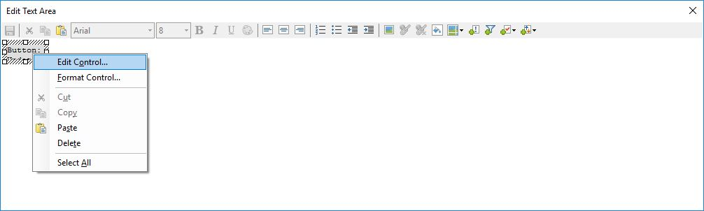

# README #

### Setup ###

The provided Spotfire Analysis example file has an embedded Python script to 
download and save as a datatable all of your wells and datapoints for those 
wells from the SOTAOG Public API.

Configure the script by setting the following script parameters

* `baseUrl` ending in `/v1`
* `credentials` as the base64 encoding of `<client_id>:<client_secret>`

By default the script will pull all datapoints starting from Jan 1 2017. 
You can change this by modifying the script parameter `defaultStartTimestamp`.

1. Edit the Text Area

2. Edit the button control

3. Click on Scripts and choose the `sotaog` python script to see the script parameters for configuration
